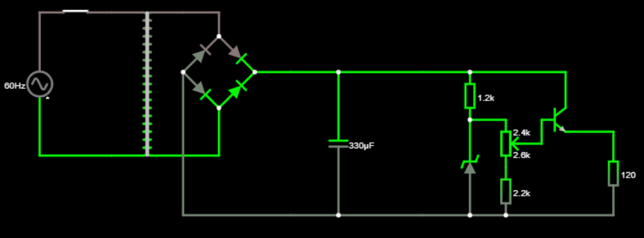
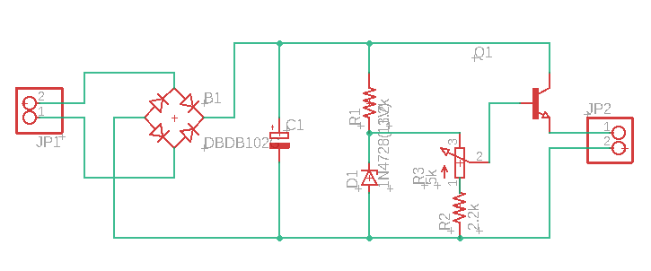
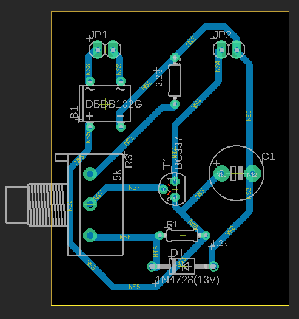

# Fonte de Tensão

## Descrição: 

Projeto da disciplina de Eletrônica para Computação - SSC0180 2020.

Fonte de Tensão regulável: 127V AC para 3-12V DC. 

## Circuito

- Circuito Principal (Com transformador 110V para 24V)

- Circuito Alternativo (Com transformador 110V para 24V + 24V - Center Tap)

- Link do circuito no Falstad: http://tinyurl.com/y9kvq46w
- Link do circuito utilizando Transformador com Center Tap: http://tinyurl.com/y8nskoj6

## Componentes do circuito principal

| Nome | Especificações | Preço\* |
|:---:|:---:|:---:|
| [Transformador](https://www.baudaeletronica.com.br/transformador-trafo-1a-24v.html) | 110V AC para 24V | R$ 36,00 |
| [Diodo](https://www.baudaeletronica.com.br/diodo-1n4007.html) | Modelo 1N4007 | 4x R$ 0,11 |
| [Capacitor Eletrolítico](https://www.baudaeletronica.com.br/capacitor-eletrolitico-470uf-35v.html) | 470uF / 35V | R$ 0,57 |
| [Diodo Zener](https://www.baudaeletronica.com.br/diodo-zener-1n4743-13v-1w.html) | Modelo 1N4743 13V / 1W | R$ 0,20 |
| [Transistor](https://www.baudaeletronica.com.br/transistor-npn-bc337.html) | Modelo NPN BC337 | R$ 0,17 |
| [Potenciômetro](https://www.baudaeletronica.com.br/potenciometro-linear-de-5k-5000.html) | 5000Ω | R$ 1,09 |
| [Resistores](https://www.baudaeletronica.com.br/resistor-1k2-5-1-4w.html) | 1200Ω e 2200Ω | 2x R$ 0,08 |

  \*Preços retirados de [Baú da Eletrônica](https://www.baudaeletronica.com.br/?gclid=EAIaIQobChMIxuPE1v6D6gIVl4aRCh1Mmwj7EAAYASAAEgI8n_D_BwE)
  

________________________________________________________________________________________________________________________________________

| Componente | Detalhes | 
|:---|---|
| Transformador | **Justificativa:** Optou-se por trabalhar a partir de 24V, e como a corrente máxima desejada é 100mA , foi utilizado um transformador 110V-24V que suporta até 500mA no circuito secundário   **Função:** Reduz a tensão de 127V para 24V |
| 4x Diodo | **Justificativa e Função:** A ponte de diodo foi utilizada a fim de aproveitar uma onde completa, auxiliando na conversão de AC para DC |
| Capacitor Eletrolítico | **Justificativa:** Com base em uma tensão de 24V, foi utilizado um capacitor de 470uF cuja maxíma tensão suportada é 35V.   **Função:** Suprir o circuito com energia elétrica e reduzir a oscilação da tensão e corrente |
| Diodo Zener | **Justificativa:** Como a tensão máxima desejada é 12V e a tensão base-emissor do transistor é 0.7V, foi utilizado um Diodo Zener de 13V   **Função:** Limitar a tensão a 13V no máximo |
| Transistor | **Justificativa:** Foi escolhido um trasistor que suporte uma corrente máxima no coletor de 500mA e uma tensão máxima de 45V   **Função:** Regular a tensão e corrente |
| Potenciômetro | **Justificativa e Função:** O potenciômetro de 5000Ω  é suficiente para alternar a tensão de 3 a 12V |
| Resistor 1200Ω | **Justificativa:** O valor da resistência foi escolhida de modo que a potência do Diodo Zener seja inferior a 1W e a tesão superior a 13V   **Função:** Limitar a corrente para o Diodo Zener |
| Resistor 2200Ω | **Justificatica e Função:** Limitar a corrente de modo que a tensão final seja no mínimo 3V |
- ["Video explicativo"](https://drive.google.com/file/d/1MUFWJ5MjBETV0r0gCYgdCWF7eo0-wIJL/view?usp=sharing)

________________________________________________________________________________________________________________________________________

Observações para o circuito alternativo: 
- Optamos pelo [transformador](https://www.usinainfo.com.br/trafos-transformadores/transformador-trafo-24v-24v-800ma-bivolt-uso-geral-3908.html) com tensão secundaria de 24V+24V.
- São necessarios apenas 2 diodos para reitificar a onda completa.

## Projeto do Esquemático e do PCB no Eagle

 

## Participantes

- João Pedro Gavassa Favoretti 
- Lucas Pilla Pimentel 
