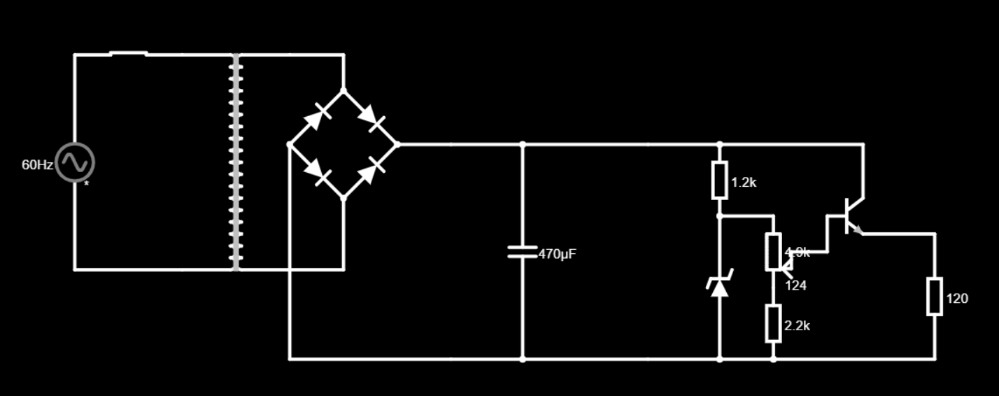

# Fonte de Tensão

### Descrição: 
Projeto da disciplina de Eletrônica para Computação - SSC0180 2020.

Fonte de Tensão regulável: 127 AC para 3v-12v DC. 

## Circuito

- Link do circuito no Falstad: http://tinyurl.com/yd9kuhjk
- Video explicativo: 

## Componentes

| Nome | Especificações | Preço |
|---|:---:|---:
| [Transformador](https://www.baudaeletronica.com.br/transformador-trafo-12v-12v-500ma-110-220vac.html) | 12V+12V 500mA - 110/220VAC | R$ 22,23 |
| [Diodo](https://www.baudaeletronica.com.br/transistor-npn-bc337.html) | Modelo 1N4007 | R$ 0,11 |
| [Capacitor Eletrolítico](https://www.baudaeletronica.com.br/capacitor-eletrolitico-470uf-35v.html) | 470uF / 35V | R$ 0,57 |
| [Diodo Zener](https://www.baudaeletronica.com.br/diodo-zener-1n4743-13v-1w.html) | 1N4743 (13v/1w) | R$ 0,20 |
| [Transistor](https://www.baudaeletronica.com.br/transistor-npn-bc337.html) | NPN BC337 | R$ 0,17 |
| [Potenciômetro](https://www.baudaeletronica.com.br/potenciometro-linear-de-5k-5000.html) | Linear de 5000Ω | R$ 1,09 |
| [Resistor](https://www.baudaeletronica.com.br/resistor-2k2-5-1-4w.html) | 2200Ω | R$ 0,08 |
| [Resistor](https://www.baudaeletronica.com.br/resistor-1k2-5-1-4w.html) | 1200Ω | R$ 0,08 |

## Participantes
- João Pedro Gavassa Favoretti
- Lucas Pilla Pimentel
